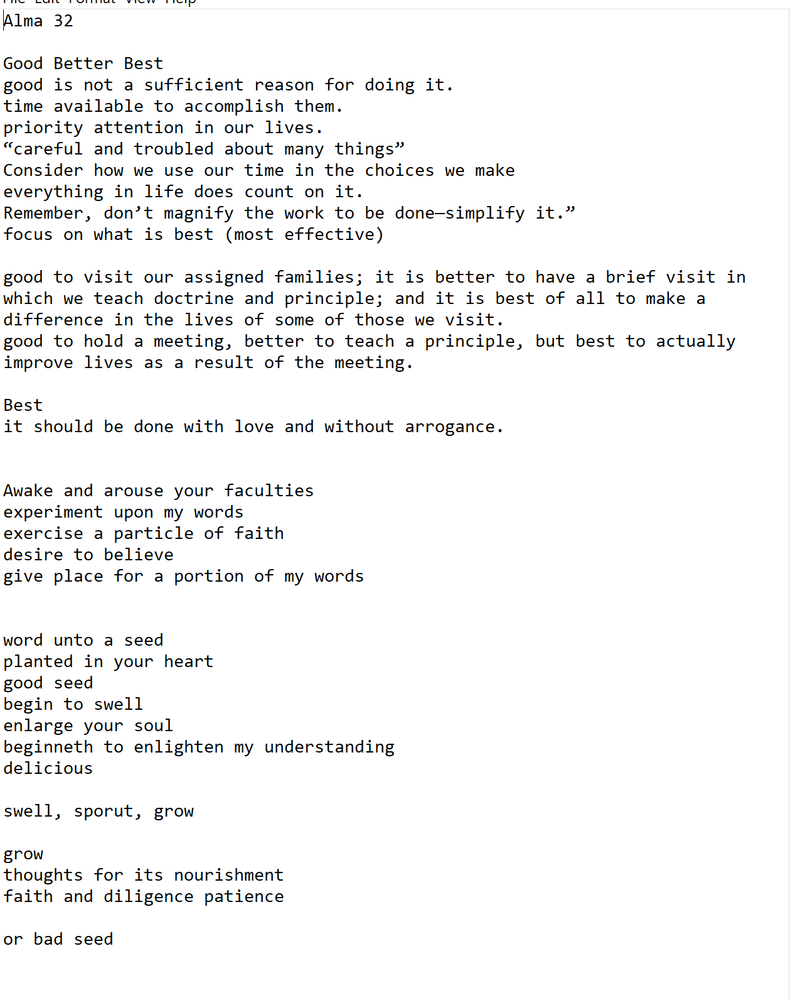
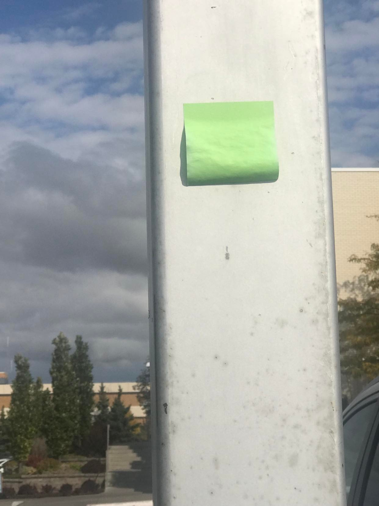
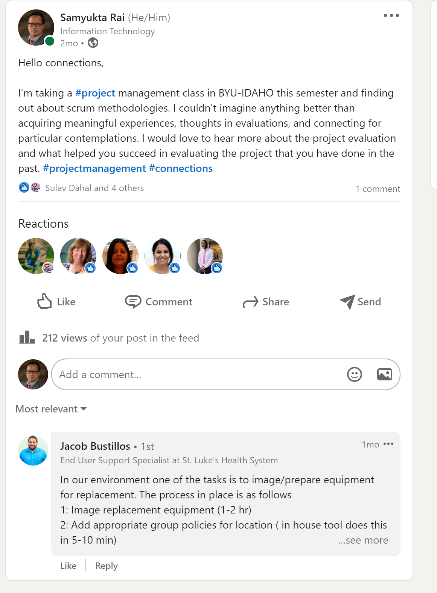
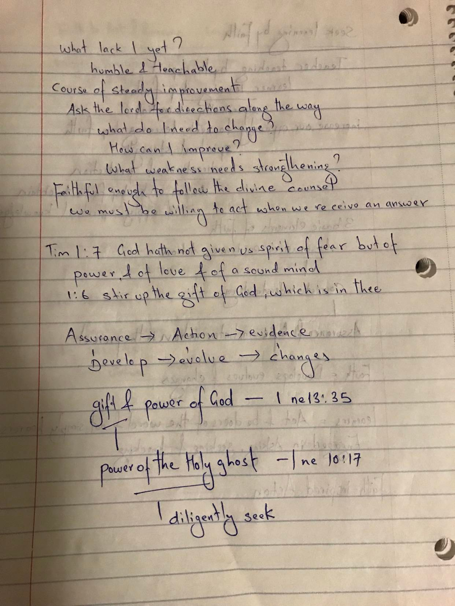
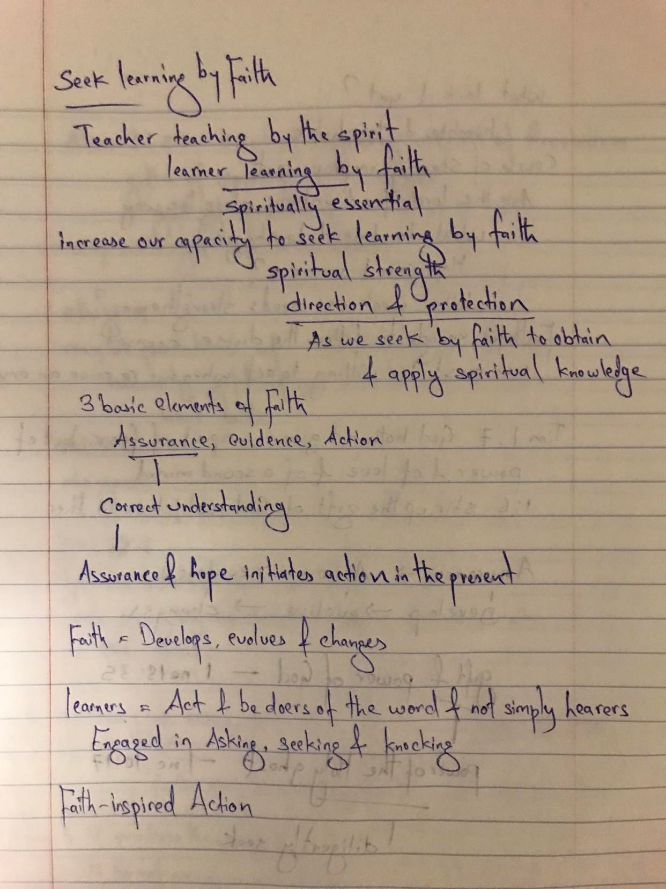
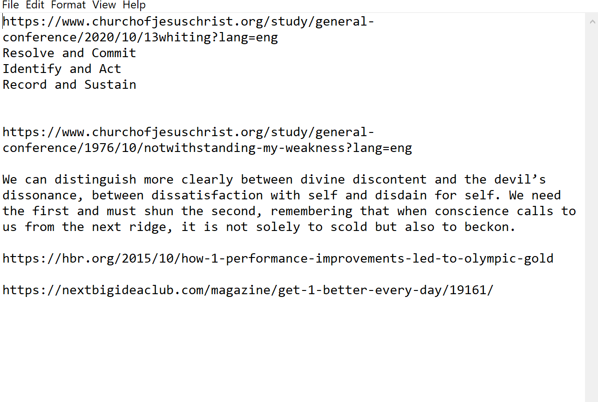
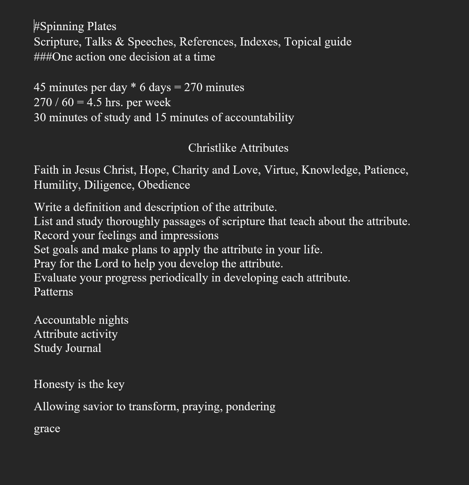

# Project Management 

## Introduction

At first, I wanted to have a group project or internship as a project and decided that I would somewhat improve, which would be simple and easy to learn. I was pondering about the topics for the project, and attributes kept coming to my mind; even in the church meeting, a speaker on the sacrament gave a talk about Christlike attributes. I was amazed at what was happening. Is it real, or I'm insane, but attributes kept coming to my mind. I thought this would be impossible to use as a project, and how would this be a team effort to learn. I thought project management should be teamwork, but I was wrong; let's read the story I have accounted below.

* I decide with the project which I named "Attribute Project"
* I planned that I'm going to use scrum but only the part as a sprint.
* I decided I'll ask brother Godfrey as my external team member as part of reporting like what would i be doing next week. I wanted to be accountable on the project.
* I decided each week I'll work on each attribute. I layed plan as this   
 
## Topics

* Week 1 Faith in Jesus Christ
* Week 2 Hope 
* Week 3 Charity and love 
* Week 4 Virtue
* Week 5 Knowledge
* Week 6 Patience 
* Week 7 Humility
* Week 8 Diligence and Obedience

**Tools I'll be using** 

# Study 
Preach my gospel and scripture throughout the project.

# Ponder
set aside every day

I had a wonderful time to visit temple to use my pondering session inside the holiness of the lord. It was a good visit and learned the importance of pondering while developing attributes of christ in temple through the spirit.

# Application

## 1st day to success 
I started with great start using trello to organize my project throughout the semester and modified so many ways. I tried to find may ways to how i can benefit my project throught this wonderful tools. It did not work out as I thought and stopped using after couple weeks. **NOT A GOOD SIGN AT ALL**

## First day 
I started with faith and pondering on my way feeling a failure. I do not have an idea why am i feeling the way that I'm feeling I was supposed to feel more faithful and should be looking for faith building experience. As i was pondering on walking on stairs I saw one person tip off and almost felt and seeing him tiped off i was feeling the same way. I was walking on a parking lot and on the pole some one had a sticky not saying **You are awesome**. I did not understand the small thing happening. Next day i was looking the same sticky not if it was still there and yes defiently it was there but guess what there is not anymore the quote on there because of the rain on the other day wash it all away. I was suprised that was still there with nothing in it. 

## linkdein post 
I used with the hope that I would learn some ideas from project aspects from professionals did not work out as I thought, but I had one person reply on the post, which is exciting.

## Family trip to Ohio 
I had a chance to make a trip to Ohio as a family visit while in class. I was looking for the opportunity how would I be able to implement the principles learned in the project management class and incorporate the principles of the attribute. 
Scene 1 
My wife's family lives in Ohio, and my wife's mother's sister's husband died, which is sad. In our culture, when someone dies in the family, they have a tradition called **mana chamal** you will be helping with food or cash as your wish; there is no specific on the tradition. We all, including my wife's sister, planned to visit their aunt, who lives in Erie, Pennsylvania, in the early morning in two cars with eight people. The following day some of us were ready to go Erie, and some weren't ready; I don't know why. We all thought we would leave early in the morning and reach as early as possible to be safely back home at night without any traffic. Unfortunately, someone did not want to go created a chaotic moment. There will be no driver to drive the car now; what happens to 2 of them who are ready to leave for Erie. The tension arose between the sister who would go and who will not. They all became mad, which was not helpful because time was far ahead of us. We are not concluding, becoming furious with each other, as I saw the problem arising with a tension between several parties. I decided to jump in and talk to each of them individually and let them know what the plan was and how we could solve it together. I spoke with them and sought the solution so we could better execute the plan. Some of them decided not to go to Erie and asked us to take their stuff with us so we could drop them off on their behalf. We ended up going only to Me, my wife, and two of her sisters. I learned a lesson to become compassionate, which did not come with the help of my lord savior Jesus christ to execute the plan so well.

##  Cost evaluation 
I had a car making a sound; when I was backing up, it sounded like the clock was ticking, and I had no idea what was going on with the car. I decided to go to the mechanic shop and let them help me figure things out what was wrong with the vehicle. I visited several mechanic shops here in town. A lot of them asked me to make an appointment with the car mechanic so they could help me out with the car. Throughout the negotiation on the car and mechanic shop, I find that each has its price and time to help me decide which one I should go with them to trust to fix that noise. 

## Internship
I was talking with brother Godfrey about how I'm struggling with finding an internship, and he helped me think about what I lacked yet? The story of rich men and Jesus in the bible. I was pondering throughout and practicing a principle and realized that God had given a gift to each of us only matters how we utilize it to bless others. 

**Here's the snippett of the reading from what I lack yet?**

Other day I recived a call from unknown number which I usually don't pick up the call from unknown number and I saw there is a voicmail and I opent he voicemail and read it was one of the recuriter from the church and left a message to call her back which i thought unusual thing to me. I called her back and pretty much she tells me that I will have an internship offer for April 2022, I was suprised an left with no words how could this be possible.

# Evaluation
prayer, fasting, friends, church and relatives close to me

I've constantly sought feedback to make sure things are right in the way that I want to make sure it is working. I have not recorded what they said to me; all I can do is write about the time we spent together to receive the feedback. They were supportive towards me, and some answers were soul searching for me. I have evaluated what they have been saying to me and what I can do. I conclude it is not easy but what you are doing is great; just put the lord's first in your life; he will guide you. I'm not sure where they want to point me, but it seems the eternal goal is Heavenly Father and Jesus Christ. I'm glad I was able to use their feedback and evaluate the attribute project. **Time worth spending in evaluation**

* study journal

**sample of my study**

Every effort to change we make—no matter how tiny it seems to us—just might make the biggest difference in our lives. [One percent better By Elder Michael A. Dunn Of the Seventy](https://www.churchofjesuschrist.org/study/general-conference/2021/10/54dunn?lang=ase)

 
# Take Away
I love this wonderful teachings from Brother Hugh B brown such a great talk it reminded me that I can't grow the way that I want to grow it's the god's will and power to mold me and shape me the way he wants me to be.
“Look, little currant bush, I am the gardener here, and I know what I want you to be. If I let you go the way you want to go, you will never amount to anything. But someday, when you are laden with fruit, you are going to think back and say, ‘Thank you, Mr. Gardener, for cutting me down, for loving me enough to hurt me.’” [God Is the Gardener HUGH B. BROWN](https://speeches.byu.edu/talks/hugh-b-brown/god-gardener/)

I have used many aspects of real life applications to use it as a project and tried to figure out what works the best and what not.

# some other notes 

